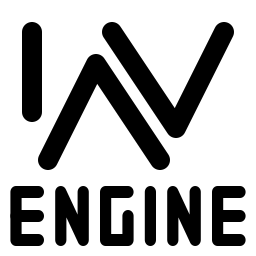

# Inversion Engine
Building the World Computer

Inversion Engine is a group of projects designed to iteratively improve the software ecosystem.

While the long-term roadmap is designed to build the World Computer, every step along the way is incredibly useful in its own right.

&nbsp;

- [Inversion Apis]() make standardizing interoperable code dirt simple.
- [The IPC Loader]() destroys the boundaries between programing languages.
- [Inversion Executor]() gets you up and running no matter your system.
- [Virtualization]() inversion challenges the very concept of a device.
